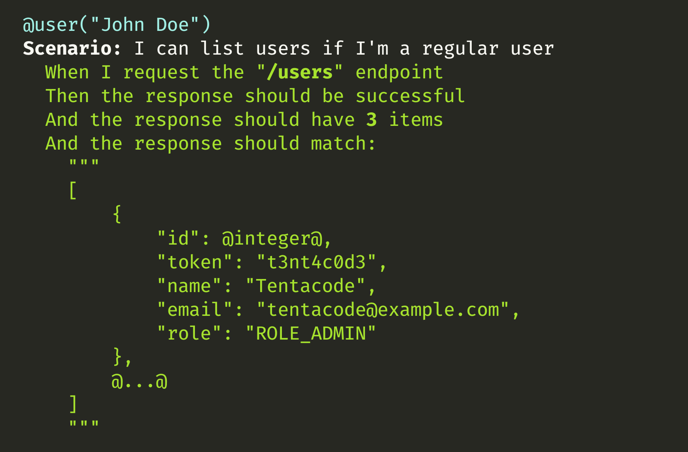

# Poc Behat

[](https://travis-ci.org/tentacode/poc-behat)



Just a small proof of concept of Behat for API testing with :

* JSON pattern matching
* Transaction rollback to preserve database integrity

Curious? have a look at :

* [composer.json](./composer.json) to see dev dependencies
* [features](./features) to look at the scenarios
* [test/Behat](./test/Behat) to see the Behat Contexts
* [src/Controller](./src/Controller) to look at the dummy controllers
* [src/DataFixtures/UserFixtures.php](./src/DataFixtures/UserFixtures.php) to see the fixtures
* [https://travis-ci.org/tentacode/poc-behat](https://travis-ci.org/tentacode/poc-behat) the travis build

## Prerequisites

* PHP 7.3
* PostrgeSQL 11.5
* Symfony client
* Composer

## How to

Setup the project:

* Copy `.env` to `.env.local` and change your `DATABASE_NAME` accordingly.
* Create `.env.test` and change your `DATABASE_NAME` accordingly (you can add the _test suffix to the database).

```bash
make install
```

Start the project:

```bash
make start
```

Stop the project:

```bash
make stop
```

## Tests

```bash
make test
```